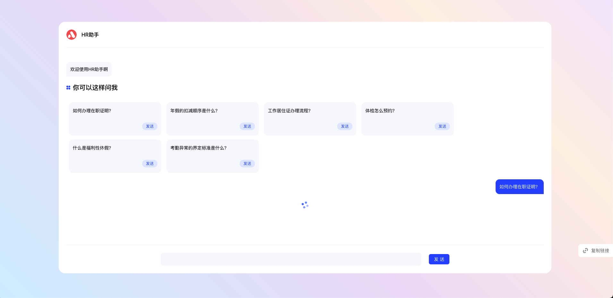
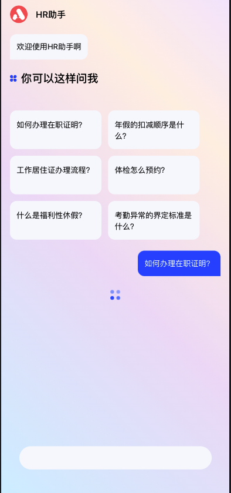

## A lightweight Chatbot UI
### PC


### Mobile


## Project Description

Chatbot UI project based on React framework, Node 16+, including following functionality
- PC and Mobile supported
- Greeting message
- Showing example question
- Send and recieve messages
- Positive and Negative review

## Config

- Optional configuration based on API mode or self-defined data
    - For self-definition mode, data structure can be modified from ```chatRoomDefaultStartModel``` in ```Config.ts```. ```ChatbotDefaultStartModel``` is default model.
    - For API mode, ```chatStartApiUrl``` should be provided in ```Config.ts``` file based on the project API URL. Notice that in this mode, the URL list below should also be provided.
        - Config.chatMessageSendApi：The API url that performs the message sending.
        - Config.chatMessageEvaluateApi： The API url that performs the action when user click like/dislike review.

## Related "Model" and "Interface"
 - Related model could be change in ```Model``` directory
 - Chatroom related function is wrapped in ```ChatBotServer```.

## How to run in dev mode and mock response
- npm run start
- For response mocking，start up Mockoon, load and config ```chatbot_management_mock.json``` file
- open http://localhost:3000/?chatbot_id=xxx, chatbot_id should be provided

## Building for production
- npm run build

## Reference

- [Mockoon](https://mockoon.com/docs/latest/about/)
- [ReactHook](https://legacy.reactjs.org/docs/hooks-intro.html)
- [Typescript](https://www.tslang.cn/docs/home.html)
- [craco](https://craco.js.org/docs/getting-started/)
- [windicss/tailwindcss](https://windicss.org/guide/configuration.html)
- [AntDesign](https://ant.design/components/overview)
- [tablericon](https://tabler-icons.io/)
- [lodash](https://www.lodashjs.com/)

